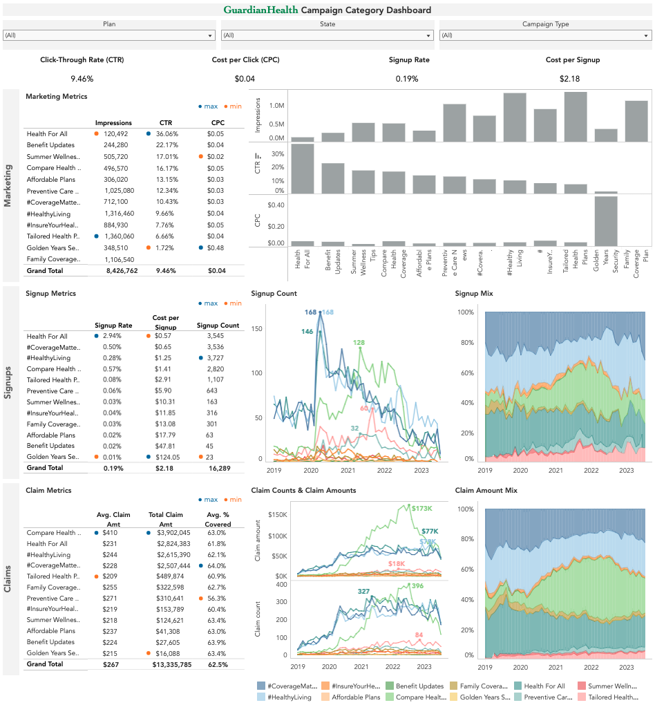

# Enabling Marketing Performance Tracking at GuardianHealth
Founded in 2016, GuardianHealth is a medical insurance company serving thousands of customers throughout the US. In 2019, they launched a new set of marketing campaign categories spanning topics like wellness tips, the affordability of their plans, and preventative care. Their customers can sign up for four different plans -- bronze, silver, gold, and platinum -- each with different premiums and claim coverage rates. 

To help the marketing team at GuardianHealth **understand and evaluate the to-date performance** of the various marketing campaign categories and **strategize their marketing budget for the year**, an interactive Tableau dashboard was developed to deliver insights on the company's **key marketing and healthcare metrics**. This dashboard is aimed at helping the marketing team build more undestanding of the effectiveness of the different campaign categories and how they relate to signups and subsequent patient claims. The marketing budget is allocated to drive two primary objectives: 1) to increase the number of customer signups, and 2) to raise awareness of GuardianHealth's brand across the country.

## Dashboard

A link to the interactive dashboard is [here](https://public.tableau.com/app/profile/rui.gao7453/viz/GuardianHealth/dashboard?publish=yes). This dashboard allows users to **filter by plan, state, and campaign type**, and focuses on **visualizing trends and reporting values** related to marketing, signup, and claim metrics. 

   

## Dataset Structure

The dataset contains 49,998 records across 3 tables, as shown in the ERD below. The tables contains information on campaigns, customer demographics, and claims filed by customers with related claim information.

   
Entity relationship diagram (ERD) of GuardianHealth's marketing data.

## North Star Metrics
**To evaluate campaign performance, the insights focused on the following key metrics:**
* **Click-through rate (CTR):** The percent of people who see a campaign and click on the associated link.
* **Cost per click (CPC):** The average dollars spent on the campaign in order to get a click. 
* **Signup rate:** The percent of people who see a campaign and subsequently sign up for a plan.
* **Cost per signup:** The average dollars spent to acquire a new customer.
* **Average claim amount:** The average dollar amount requested for healthcare services rendered to a customer. 

## Summary of Insights

### Marketing metrics: click-through rate (CTR), cost per click (CPC)
* Across campaign categories, the *Health For All* campaign has the **highest CTR at 36%** (**~4X higher** than the average) even though it has the **lowest number of impressions** across campaigns (120K). The next best-performing campaign is *Benefit Updates* with a CTR of 22%. Within these two high-CTR categories, product promotion-based campaign types had relatively low CTR (0% and 7%, respectively).
  
* Conversely, the *Golden Years Security* campaign has the **lowest CTR at 1.7%**; its low number of clicks in proportion to the cost of the campaign leads to an **abnormally high CPC of $0.48**. The remaining campaigns appear to be more appropriately budgeted, all having CPCs ranging from $0.02 - $0.05.
  
* *Family Coverage Plan* had high impressions (1M+) but no clicks. This needs to be investigated and could be due to missing data or issues with the campaign.

### Signup metrics: signup rate, cost per signup
* Across categories, *Health For All* had the **highest signup rate at ~3%** (**16X higher** than the average) and **lowest cost per signup**. Its high signup rate is driven by health awareness-type marketing (3.72% signup rate). *Golden Years Security* had the **lowest signup rate at 0.01%** and its cost per signup is more than **an order of magnitude higher than the average ($123 vs $2.18)**. 

* Most categories saw a significant spike in signups at the start of the pandemic (April 2020). 3 categories (*#CoverageMatters, #HealthyLiving, Health For All*) hit **record-high signups in this initial spike** and also accounted for the majority of signups early in the pandemic, while categories like *Compare Health Coverage* and *Tailored Health Plans* experienced a second, larger spike later in the pandemic and drove a greater share of signups in the second half of 2021. This may potentially reflect customers' shifting healthcare coverage preferences throughout the pandemic; emphasis appears to shift from comprehensive coverage in the early stages of COVID-19 to personalization and choice in the later stages.  

* While the pandemic helped to boost signups, most categories saw a decrease in signups from mid-2022 onward, with signups in most recent months falling below pre-pandemic levels. The *#Coverage Matters* and *#HealthyLiving* marketing categories appear to be more resilient to this post-pandemic downward trend, accounting for the **bulk of signups (~58%)** more recently. 

### Claim metrics:
* Claim counts and claim amounts rose at the start of the pandemic, in tandem with the increase in signups, and have remained steady over time across most campaign categories. Customers who signed up through the *Compare Health Coverage* campaign show a notable difference in trends. The total claim amounts submitted by these customers steadily increased throughout 2021 - 2022, peaking at a record-high of $173K in July 2022 before significantly decreasing in the following months due to a decrease in claim counts. These customers submitted the **most expensive claims on average at $410 per claim**, ~50% higher than the average claim amount of $267.  

* Bronze plans offer the lowest average claim coverage rate at 51%, followed by silver (62%), gold (71%), and platinum (80%). **Silver plans are the most popular plan type (accounting for 85% of total customers)** and account for **85% of the total dollar amount claimed to-date**.

## Initial Recommendations
* _Double down on winning campaigns_: 
  * The *Health For All* campaign has the highest CTR, signup rate, and lowest cost per signup; increase budget allocation for this campaign category and consider ways to increase its reach to improve impressions. 
  * Maintain or increase budget allocation for *#CoverageMatters* and *#HealthyLiving* campaigns, given they show post-pandemic resilience in signups and currently capture a large portion of new customers. Regroup with marketing team to understand potential reasons for why these categories were able to maintain performance when other campaigns were not.
  * Investigate reasons for *Health For All*'s high CTR and apply those findings to improve marketing copy for other campaign categories, particularly those with high impression counts.  

* _Revamp or reallocate underperforming campaigns_: The *Golden Years Security* campaign has the lowest CTR, signup rate, and highest cost per signup. Gather more context from the business team to understand if this customer demographic is important to the company. Depending on the input, either explore ways to boost engagement, perhaps by adjusting this campaign's marketing channels (social media may not be the best fit for this audience; consider perhaps partnering with senior citizen organizations) *or* reallocate budget to the *Health For All* campaigns. 

* _Develop campaigns highlighting preventative care strategies_: Customers driven through the *Compare Health Coverage* campaign have the highest average claim amounts -- collaborate with the actuarial team to conduct a deeper dive into these customers' demographics and health needs to ensure this campaign is not attracting a customer base with higher risk profiles than anticipated. Consider incorporating messaging that promotes preventive care services into future copy to potentially lower future claim amounts. 

## Credits
ERD was created using [dbdiagram.io](https://dbdiagram.io/). 
