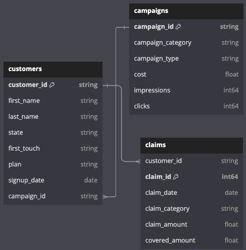

# Enabling Performance Tracking for GuardianHealth
Founded in 2016, GuardianHealth is a medical insurance company serving thousands of customers throughout the US. In 2019, they launched a new set of marketing campaign categories spanning topics like wellness tips, the affordability of their plans, and preventative care. Their customers can sign up for four different plans -- bronze, silver, gold, and platinum -- each with different premiums and claim coverage rates. 

To help the marketing team at GuardianHealth **understand and evaluate the to-date performance** of the various marketing campaign categories and **strategize their marketing budget for the year**, an interactive Tableau dashboard was developed to deliver insights on the company's **key marketing and healthcare metrics**. 

A link to the interactive dashboard is [here](https://public.tableau.com/app/profile/rui.gao7453/viz/GuardianHealth/dashboard?publish=yes).

   

## Dataset Structure

The dataset contains 49,998 records across 3 tables, as shown in the ERD below. 

   
Entity relationship diagram (ERD) of GuardianHealth's marketing data.

## North Star Metrics
* Click-through rate (CTR)
* Cost per click (CPC)
* Impressions
* Number of signups
* Signup rate
* Claim counts
* Claim amount (average and total)

## Summary of Insights

### Marketing metrics: Click-Through Rate, Cost per Click, and Impressions
* Across all plans, the *Health For All* campaign category has the **highest click-through rate at 36%**, far surpassing the average CTR of 9.5%, even though it has the **lowest number of total impressions** across categories at 120K impressions. 

* The *Golden Years Security* campaign category has the **lowest CTR at 1.7%**; due to its low number of clicks, in proportion to the cost of the campaign, it has an **abnormally high cost per click value of $0.48**. The rest of the campaigns appear to be more appropriately budgeted, all having CPCs ranging from $0.02 - $0.05. 

* The top 4 campaign categories that broke **1M+ in impressions** are *Tailored Health Plans, #HealthyLiving, Family Coverage Plan,* and *Preventive Care News*.

### Signup metrics:
* *Health For All* had the **highest signup rate across cateogries at ~3%** -- substantially higher than the average signup rate of 0.19% -- and lowest cost per signup. *Golden Years Security* had the **lowest signup rate at 0.01%** and its cost per signup at $123 is more than **an order of magnitude higher than the average** across all categories. 

* Many categories saw a significant spike in signups at the start of the pandemic. 3 categories (*#CoverageMatters, #HealthyLiving, Health For All*) drove record-high signups in April 2020 and accounted for the majority of signups early in the pandemic, while categories like *Compare Health Coverage* and *Tailored Health Plans* reached record-high signups later in the pandemic and drove a greater share of signups in the second half of 2021. This may potentially reflect customers' shifting healthcare coverage preferences throughout the pandemic, from a focus on comprehensive coverage in the early stages of the pandemic to more interest in personalization and choice in the later stages.  

* While the pandemic helped to boost signups, signup counts from most categories significantly decreased starting in mid-2022, and falling to levels below pre-pandemic values. The *#Coverage Matters* and *#HealthyLiving* marketing categories appear to be more resilient to post-pandemic downward trends, accounting for the bulk of signups (~58%) in recent months. 

### Claim metrics:
* Claim amounts rose at the start of the pandemic and have remained steady over time across most campaign categories, with the notable difference being claims from customers marketed through the *Compare Health Coverage* campaign. The total claim amounts submitted by these customers steadily increased throughout 2021 and into 2022, reaching a record-high of $173K in July 2022 before significantly decreasing in the following months. These customers submitted the **most expensive claims on average at $410 per claim**, ~50% higher than the average claim amount of $267.  

* Bronze plans offer the lowest average claim coverage rate at 51%, followed by silver (62%), gold (71%), and platinum (80%). **Silver plans are the most popular plan type** and silver plan customers account for 85% of the total amount claimed to-date.

## Recommendations
* *Double down on winning campaigns*: The *Health For All* campaign has the highest CTR, signup rate, and lowest cost per signup; increase budget allocation for this campaign category and consider ways to increase its reach (e.g., different marketing channels, targeting broader demographics). Maintain or increase budget allocation for *#CoverageMatters* and *#HealthyLiving* categories, given they show post-pandemic resilience in signups and currently capture a large portion of new customers. Investigate reasons for *Health For All*'s high CTR and apply those findings to improve other campaign categories, particularly those with high impression counts.  

* *Revamp underperforming campaigns*: The *Golden Years Security* campaign has the lowest CTR, signup rate, and highest cost per signup. Explore ways to boost engagement by adjusting targeted demographic (e.g., focusing on specific age group or health conditions) and/or marketing channel -- social media may not be the best fit for this audience; consider perhaps partnering with senior citizen organizations. 

* *Post-pandemic retention*: Investigate reasons for the post-pandemic signup decline across categories and consider implementing plan features to attract new customers.

* *Develop campaigns highlighting preventative care strategies*: Customers driven through the *Compare Health Coverage* campaign have the highest average claim amounts -- analyze their demographics and health needs to ensure this campaign is not attracting a customer base with higher risk profiles than anticipated. Consider incorporating messaging that promotes preventive care services to potentially lower future claim amounts. 

## Credits
* ERD was created with [dbdiagram.io](https://dbdiagram.io/). 
